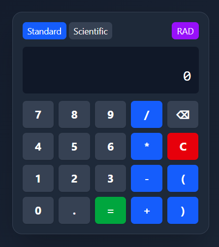
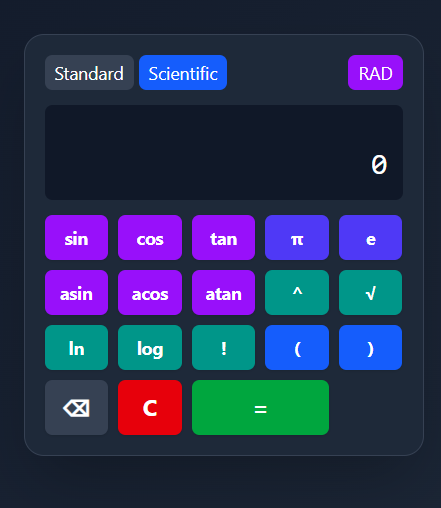

# Scientific Calculator 

## 🔗 Live Demo

[👉 Click here to use the Calculator](https://bharat346.github.io/calculator/)

## 📸 Screenshots

| Calculator 1 | Calculator 2 |
|--------------|--------------|
|  |  |


A feature-rich scientific calculator built with React that handles both basic and advanced mathematical operations with a clean, modern interface.

## ✨ Features

- **Dual Mode Operation**
  - 🧮 Standard calculator for basic arithmetic
  - 🔬 Scientific mode for advanced functions
- **Mathematical Functions**
  - 📐 Trigonometric (sin, cos, tan)
  - 🔄 Inverse trigonometric (asin, acos, atan)
  - 📊 Logarithmic (log, ln)
  - ➗ Square roots and exponents
  - ❗ Factorials
  - 🔵 Constants (π, e)
- **Angle Unit Support**
  - 🔄 Radians/Degrees toggle
- **Calculation History**
  - ⏮️ Shows last 3 calculations
- **Keyboard Support**
  - ⌨️ Full keyboard input mapping
- **Responsive Design**
  - 📱 Works on all screen sizes

## 🚀 Installation

```bash
# 1. Clone the repository
git clone https://github.com/Bharat346/calculator.git

# 2. Navigate to project directory
cd Calculator

# 3. Install dependencies
npm install

# 4. Start development server
npm start
```

## 💡 Usage Examples

### Basic Operations
```js
5 + 3 = 8
10 - 4 = 6
2 * 6 = 12
8 / 2 = 4
```

### Scientific Functions
```js
sin(30) = 0.5 (in degrees mode)
asin(0.5) = 30 (in degrees mode)
log(100) = 2
ln(e) = 1
5! = 120
2^3 = 8
√9 = 3
```

## ⌨️ Keyboard Shortcuts

| Key | Function       | Key | Function       |
|-----|----------------|-----|----------------|
| 0-9 | Numbers        | s   | sin            |
| +   | Addition       | c   | cos            |
| -   | Subtraction    | t   | tan            |
| *   | Multiplication | S   | asin           |
| /   | Division       | C   | acos           |
| ^   | Exponent       | T   | atan           |
| !   | Factorial      | l   | ln             |
| ( ) | Parentheses    | L   | log            |
| .   | Decimal        | q   | Square root    |
| =   | Equals         | p   | π              |
| ⌫   | Backspace      | e   | e constant     |
| r   | Toggle radians/degrees | m | Toggle mode |

## 🛠️ Technical Implementation

### Core Logic Architecture
```javascript
// Example of the main calculation logic
const handleCalculation = (expression) => {
  // 1. Normalize expressions (2π → 2*π)
  // 2. Convert functions to Math.* equivalents
  // 3. Handle angle unit conversions
  // 4. Evaluate safely
  // 5. Return result with error handling
};
```

### Component Structure
```
src/
├── pages/
│   ├── Calculator.jsx         # Main component
│   ├── CalculatorButtons.jsx  # Button components
│   ├── CalculatorDisplay.jsx  # Display component
│      
├── utils/   
│   ├── CalculatorLogic.js     # Computation logic
|   |
├── App.js
└── index.js
```

## 🏗️ Development

### Available Scripts
```bash
npm start    # Runs the app
npm test     # Runs tests
npm run build # Creates production build
```

### Dependencies
- React 18+
- Tailwind CSS
- Vite (or Create React App)

## 🤝 Contributing
1. Fork the project
2. Create your feature branch (`git checkout -b feature/AmazingFeature`)
3. Commit your changes (`git commit -m 'Add some amazing feature'`)
4. Push to the branch (`git push origin feature/AmazingFeature`)
5. Open a Pull Request

## 🙏 Acknowledgements
- Math.js for expression parsing inspiration
- Tailwind CSS for amazing utility classes
- React community for awesome components

---
